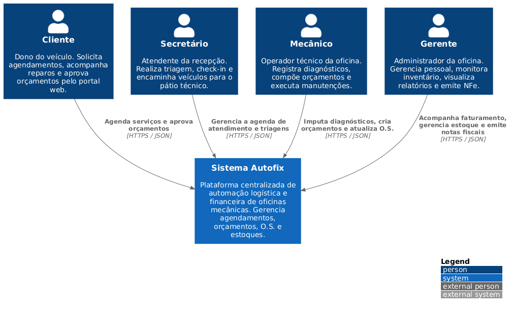
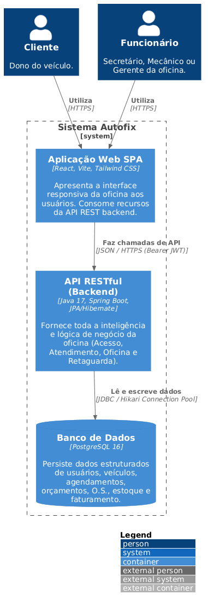
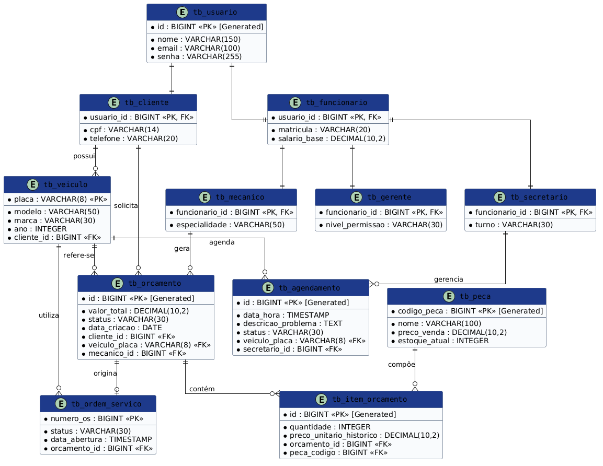

# 🛠️ Autofix - Gestão Inteligente de Oficinas 👨‍💻

> Sistema integrado de automação operacional para oficinas mecânicas.  
> Foco na eliminação de gargalos na triagem, agendamento ágil e controle do ciclo de vida de Ordens de Serviço e estoques.

---

## 🚧 Status do Projeto
📌 Projeto acadêmico em desenvolvimento (PUC Minas)

---

## 📚 Índice

- [🔗 Links Úteis](#-links-úteis)
- [📝 Sobre o Projeto](#-sobre-o-projeto)
- [✨ Funcionalidades Principais](#-funcionalidades-principais)
- [🛠 Tecnologias Utilizadas](#-tecnologias-utilizadas)
- [🏗 Arquitetura](#-arquitetura)
- [📊 Exemplos de Diagramas](#-exemplos-de-diagramas)
- [🔧 Instalação e Execução](#-instalação-e-execução)
- [🔑 Variáveis de Ambiente](#-variáveis-de-ambiente)
- [📦 Instalação de Dependências](#-instalação-de-dependências)
- [💾 Banco de Dados](#-banco-de-dados)
- [⚡ Execução](#-execução)
- [🐳 Docker](#-docker)
- [🚀 Deploy](#-deploy)
- [📂 Estrutura de Pastas](#-estrutura-de-pastas)
- [🎥 Demonstração](#-demonstração)
- [🧪 Testes](#-testes)
- [📚 Documentações](#-documentações)
- [👥 Autores](#-autores)
- [🤝 Contribuição](#-contribuição)
- [🙏 Agradecimentos](#-agradecimentos)
- [⚖️ Licença](#-licença)

---

## 🔗 Links Úteis

- 🌐 Demo Online: Acesse a Aplicação Web Autofix  
- 📖 Documentação da API: Swagger  

---

## 📝 Sobre o Projeto

O Autofix foi idealizado para resolver problemas reais do fluxo operacional de oficinas mecânicas:

- Falta de sincronização entre setores  
- Retrabalho operacional  
- Erros de estoque  
- Atrasos no atendimento  

### 👥 Atores

- Cliente  
- Secretário  
- Mecânico  
- Gerente  

Projeto desenvolvido na **PUC Minas**.

---

## ✨ Funcionalidades Principais

- 🔐 Autenticação com JWT  
- 🗓️ Agendamento online  
- 🛠️ Gestão de O.S. e orçamentos  
- 📦 Controle automático de estoque  
- 📊 Alertas de estoque mínimo  

---

## 🛠 Tecnologias Utilizadas

### 💻 Front-end
- React  
- TypeScript  
- Tailwind CSS  
- Vite  

### 🖥️ Back-end
- Java 17  
- Spring Boot  
- JPA / Hibernate  
- PostgreSQL  
- JWT  

### ⚙️ Infraestrutura
- Docker  
- Docker Compose  
- Vercel  

---

## 🏗 Arquitetura

O sistema segue o padrão **MVC (Model-View-Controller)**:

- Controller → recebe requisições  
- Service → regras de negócio  
- Repository → acesso ao banco  

### 🧬 Modelagem

- Herança com estratégia **JOINED**  
- Normalização de dados  

---

## 📊 Exemplos de Diagramas

### 🧭 C4 - Nível 1 (Contexto)

Mostra a visão macro do sistema, destacando os atores externos e a interação com o Autofix.



---

### 🏗️ C4 - Nível 2 (Contêiner)

Detalha os principais componentes internos do sistema, incluindo frontend, backend e banco de dados.



---

### 🗄️ Modelo de Dados (DER)

Representa a estrutura relacional do banco de dados, incluindo entidades, relacionamentos e heranças.



## 🔧 Instalação e Execução

### ✅ Pré-requisitos

- Java 17+  
- Node.js 18+  
- Docker  

---

## 🔑 Variáveis de Ambiente

### Back-end

```env
SERVER_PORT=8080
SPRING_DATASOURCE_URL=jdbc:postgresql://localhost:5432/autofix
SPRING_DATASOURCE_USERNAME=postgres
SPRING_DATASOURCE_PASSWORD=senha-segura-123
```

### Front-end

```env
VITE_API_URL=http://localhost:8080/api
```

---

## 📦 Instalação de Dependências

```bash
git clone https://github.com/seu-usuario/autofix.git
cd autofix
```

### Front-end

```bash
cd frontend
npm install
cd ..
```

### Back-end

```bash
cd backend
./mvnw clean install
cd ..
```

---

## 💾 Banco de Dados

```bash
docker run --name autofix_db \
-e POSTGRES_USER=postgres \
-e POSTGRES_PASSWORD=senha-segura-123 \
-e POSTGRES_DB=autofix \
-p 5432:5432 -d postgres:16
```

> ✅ As tabelas são criadas automaticamente via Hibernate (`ddl-auto: update`)

---

## ⚡ Execução

### Terminal 1 – Back-end

```bash
cd backend
./mvnw spring-boot:run
```

➡️ http://localhost:8080

### Terminal 2 – Front-end

```bash
cd frontend
npm run dev
```

➡️ http://localhost:5173

---

## 🐳 Docker

```bash
docker-compose up --build -d
```

Para parar:

```bash
docker-compose down
```

---

## 🚀 Deploy

```bash
cd frontend && npm run build
cd ..
cd backend && ./mvnw clean package
cd ..
```

---

## 📂 Estrutura de Pastas

```
.
├── .gitignore                  # 🧹 Arquivos e pastas ignorados
├── README.md                  # 📘 Documentação principal do projeto
├── docker-compose.yml         # 🐳 Orquestração (frontend + backend + banco)
│
├── /Diagramas                 # 📊 Diagramas do sistema
│   └── /Imagens
│       ├── Arquitetura-C4-Nivel1.png   # 🧭 C4 - Contexto
│       ├── Arquitetura-C4-Nivel2.png   # 🏗️ C4 - Contêiner
│       └── Modelo-de-Dados.png         # 🗄️ DER
│
├── /frontend                  # 💻 Aplicação React (Interface do usuário)
│   ├── /public                # 📂 Arquivos estáticos
│   ├── /src                   # 📂 Código-fonte React
│   │   ├── /components        # 🧱 Componentes reutilizáveis
│   │   ├── /pages             # 📄 Páginas da aplicação
│   │   ├── /services          # 🔌 Integração com API
│   │   ├── /hooks             # 🎣 Hooks personalizados
│   │   ├── /styles            # 🎨 Estilização global
│   │   ├── /assets            # 🖼️ Imagens e recursos
│   │   └── /utils             # 🛠 Funções utilitárias
│   ├── package.json           # 📦 Dependências
│   └── vite.config.js         # ⚙️ Configuração do Vite
│
├── /backend                   # 🖥️ API Spring Boot
│   ├── /src/main/java
│   │   └── /com/autofix/app
│   │       ├── /controller    # 🎮 Endpoints REST
│       │       ├── /service       # ⚙️ Regras de negócio
│       │       ├── /repository    # 🗄️ Acesso ao banco (JPA)
│       │       ├── /model         # 🧬 Entidades
│       │       ├── /dto           # ✉️ Data Transfer Objects
│       │       ├── /config        # 🔧 Configurações (CORS, Security, etc)
│       │       ├── /security      # 🛡️ JWT e autenticação
│       │       └── /exception     # 💥 Tratamento de erros
│   │
│   ├── /src/main/resources    # 📂 Configurações da aplicação
│   │   ├── application.yml    # ⚙️ Config principal
│   │   └── /db                # 💾 Scripts ou migrações (opcional)
│   │
│   ├── /src/test/java         # 🧪 Testes automatizados
│   └── pom.xml                # 🛠 Build Maven
│
└── /scripts                  # 📜 Scripts auxiliares (opcional)
    ├── dev.sh
    ├── build.sh
    └── run.sh
```

---

## 🎥 Demonstração

- Painel do Mecânico  
- Controle de Ordens de Serviço  

---

## 🧪 Testes

```bash
cd backend
./mvnw test
```

- Testes unitários (Mockito)  
- Testes de integração (JPA)  

---

## 📚 Documentações

- Spring Boot  
- React  
- Hibernate  
- PostgreSQL  

---

## 👥 Autores

- Mateus Azevedo Araújo  

---

## 🤝 Contribuição

1. Fork do projeto  
2. Criar branch (`git checkout -b feature/nome`)  
3. Commit (`git commit -m 'feat: nova funcionalidade'`)  
4. Push (`git push origin feature/nome`)  
5. Abrir Pull Request  

---

## 🙏 Agradecimentos

Ao Prof. Dr. João Paulo Aramuni pelo suporte acadêmico.

---

## ⚖️ Licença

MIT
